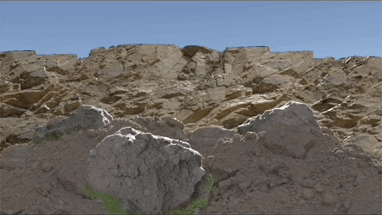
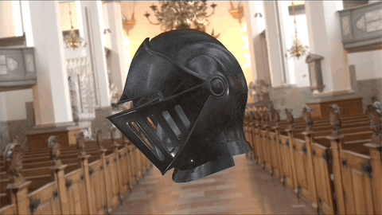

# Realtime Realistic Reflections Using the Disney BRDF

This project is an implementation of the *Disney BRDF* produced at *Walt Disney Animation Studios*.
[DisneyBRDF Paper By Brent Burley](https://media.disneyanimation.com/uploads/production/publication_asset/48/asset/s2012_pbs_disney_brdf_notes_v3.pdf "DisneyBRDF Paper By Brent Burley")

This implementation was done using Unity Engine v3.8.

The repo consists of two files:
  1) *DisneyBRDF_Lit.shader* - Consists of the HLSL code for the BRDF itself alongside texture map initializations and a rendering pass for shadow casting   
     - The code for the BRDF is directly referenced by its GLSL implementation for the BRDF explorer found at the following link:   
     [GLSL Disney BRDF](https://github.com/wdas/brdf/blob/main/src/brdfs/disney.brdf "GLSL Disney BRDF")
  2) *brdf_math.cginc* - An include file that is utilized in the first file for all of the essential PBR-related math needed to implement the Disney BRDF.

**Note*: There are no textures or materials in this repo, just the shader program.*

## Usage Instructions

* Clone this repository: `git clone 'https://github.com/dhodzic1/DisneyBRDF_Unity'`
  
* Start a new project in Unity
  * In the Project window right click and import shader code via `Import New Asset`
  * Import preferred assets that contain texture maps utilizing the same method as above   
    - **Note** that this implementation supports the following texture maps:
    *Base Texture, Roughness, Metallic, Normal, Ambient Occlusion, Reflection*
      
* In the Project window, right click and go to `Create -> Material`
  * Select newly created material and view it in the `Inspector` window
  * Select the dropdown menu `Shader` and select `DisneyBRDF_Lit.shader`
  * Drop your asset in the `Scene` window and drag the newly created material onto it
  * Apply texture maps to the material and adjust sliders to desired effect
